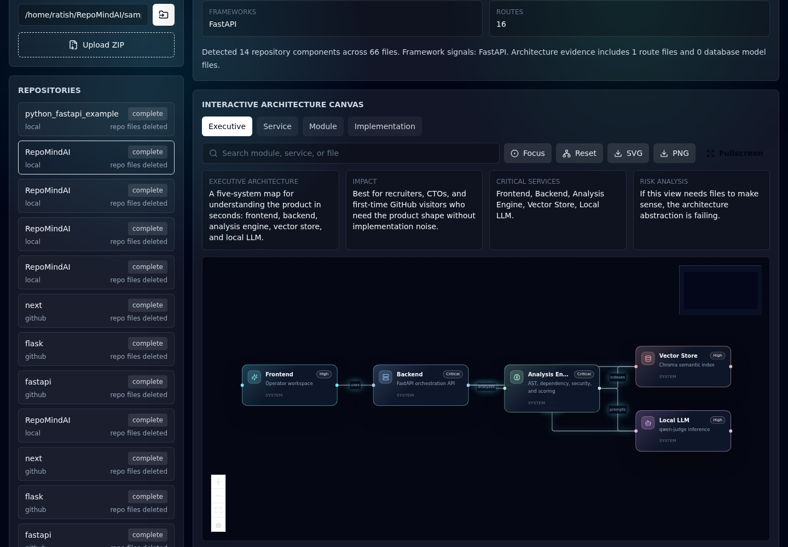
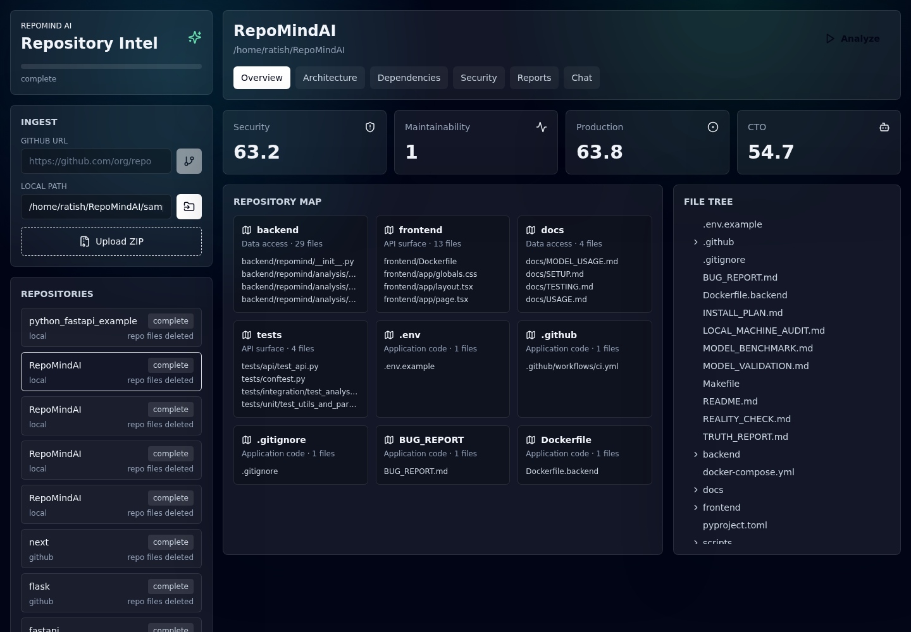
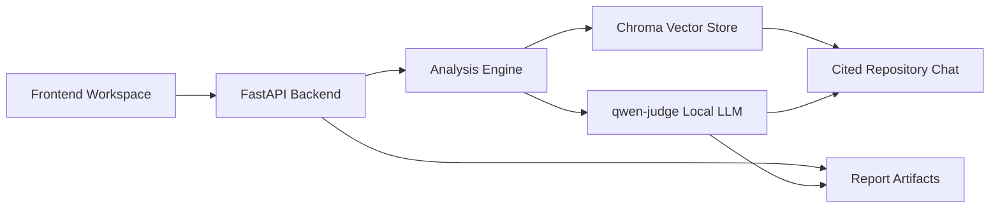
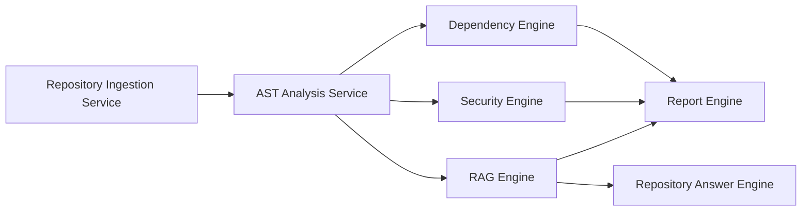
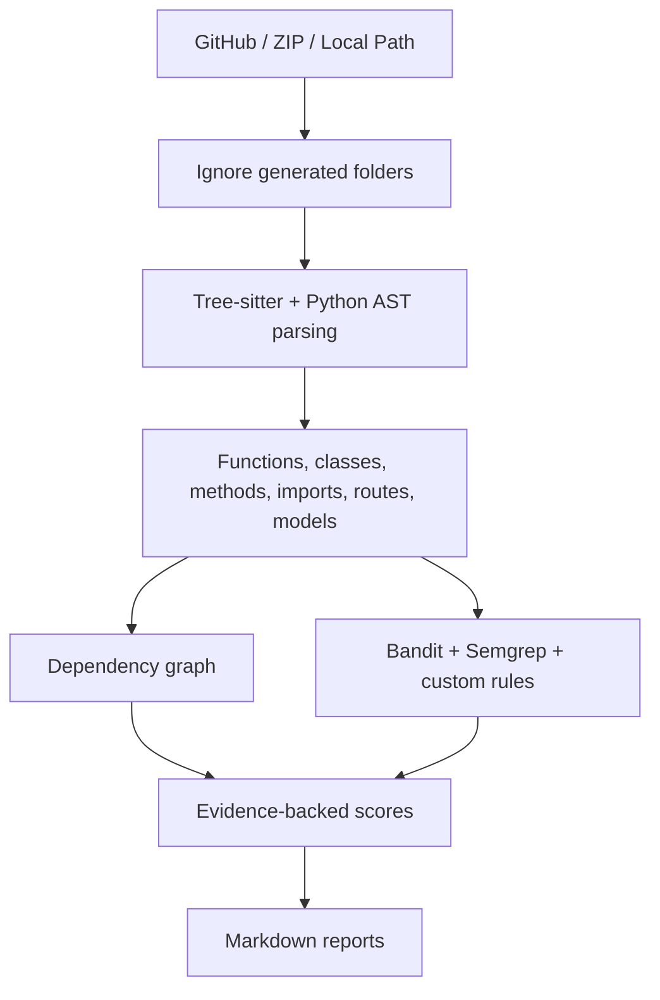
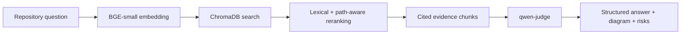
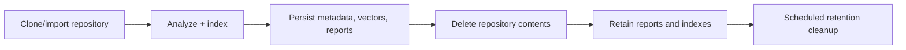
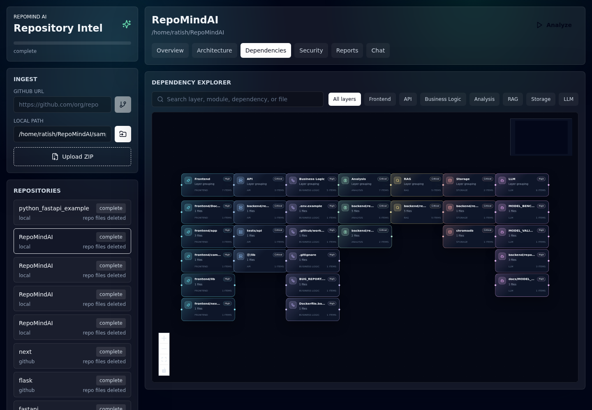
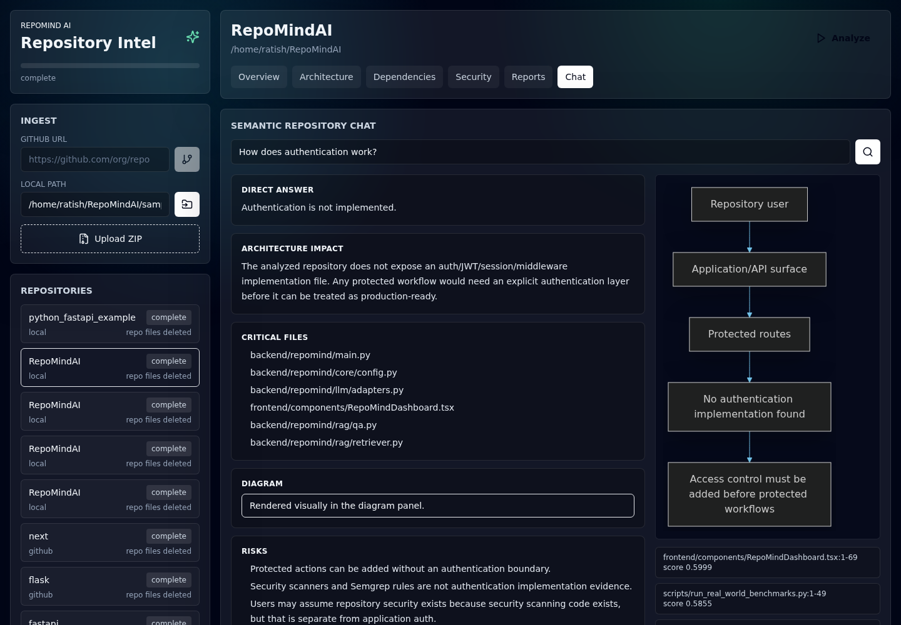
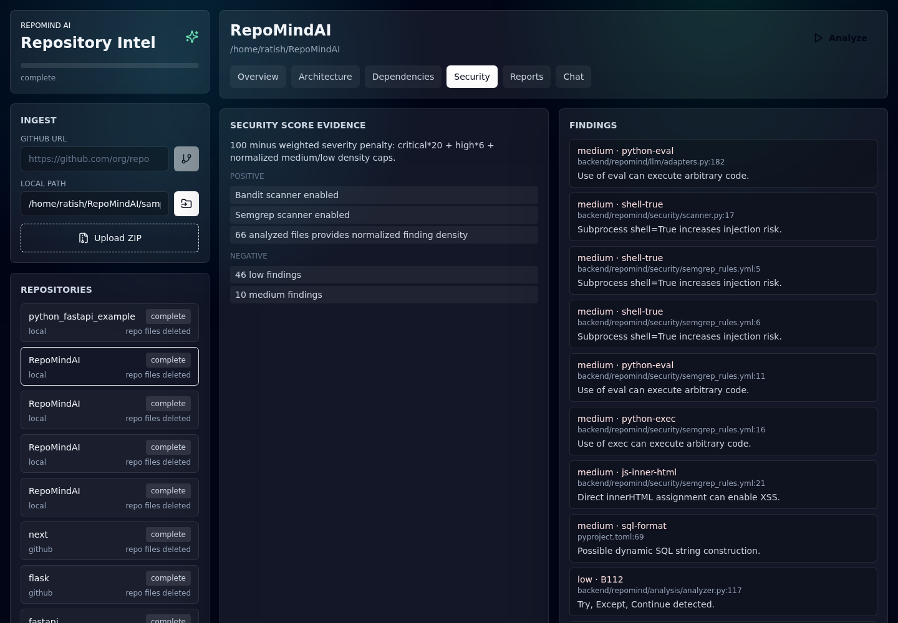

# RepoMind AI

**Offline AI-Powered Repository Intelligence Platform**




RepoMind AI turns a GitHub URL, ZIP, or local repository into an evidence-backed intelligence workspace: architecture maps, dependency views, security findings, CTO/recruiter reports, technical debt summaries, and cited repository chat.

It runs locally. The only generation model is:

```text
/home/ratish/Forge/models/qwen-judge
```

No model routing. No cloud LLM fallback. No mock answers.

## What It Does

RepoMind AI analyzes real repositories and keeps the result after the source checkout is deleted.



- Ingest a GitHub repository, ZIP archive, or local folder.
- Parse Python, JavaScript, TypeScript, JSX, and TSX with AST extraction.
- Build repository summaries, route maps, dependency graphs, security findings, and score evidence.
- Index code with `BAAI/bge-small-en-v1.5` embeddings in ChromaDB.
- Answer repository questions with retrieval, reranking, citations, Mermaid diagrams, and qwen-judge inference.
- Generate CTO, recruiter, security, technical debt, roadmap, and project status reports.
- Persist metadata, vector indexes, and reports.
- Delete cloned repository contents after analysis to avoid repository accumulation.

## Architecture

### Executive Architecture



### Service Architecture



### Analysis Pipeline



### RAG Pipeline



### Repository Lifecycle



## Architecture Experience


The Architecture tab is designed as the hero surface:

- **Executive Architecture**: business-system view with no files.
- **Service Architecture**: ingestion, AST analysis, dependency, security, RAG, and reporting services.
- **Module Architecture**: collapsed module groups with optional expansion.
- **Implementation Architecture**: files, routes, symbols, and imports only when debugging.

The graph uses React Flow, ELK auto-layout, Dagre fallback, animated edges, minimap, zoom, search, focus, fullscreen, service icons, and hover impact cards.

## Dependency Explorer



The dependency view groups code by architectural layer:

- Frontend
- API
- Business Logic
- Analysis
- RAG
- Storage
- LLM

This avoids file-level hairballs while still exposing critical paths and module details.

## Repository Chat



Example question:

```text
How does authentication work?
```

RepoMind AI answers with:

- Direct answer
- Architecture impact
- Critical files
- Rendered Mermaid diagram
- Risks
- Improvements
- Citations

If evidence does not exist, the product says so. For RepoMindAI itself, authentication is correctly reported as not implemented.

## Security View



Security analysis combines:

- Bandit findings
- Semgrep findings
- Custom repository rules
- Evidence-backed scoring
- Positive and negative score contributors

## Why It Is Different

| Tool | Strength | RepoMind AI difference |
|---|---|---|
| Sourcegraph | Enterprise-scale code search | RepoMind AI focuses on local repository intelligence, generated reviews, diagrams, and offline model inference. |
| Cursor | IDE-native code assistance | RepoMind AI is a repository-level audit and showcase surface, not an editor autocomplete loop. |
| GitHub code search | Fast symbol/text lookup | RepoMind AI adds AST extraction, vector retrieval, reports, security scoring, architecture maps, and cited answers. |

## Features

- Local-first qwen-judge inference.
- Real BGE embeddings and ChromaDB vector search.
- AST parsing for Python, TypeScript, JavaScript, TSX, and JSX.
- Architecture diagrams at executive, service, module, and implementation levels.
- Layered dependency graph with search, minimap, zoom, and focus.
- Cited repository chat with answer-quality guardrails.
- Security audit with Bandit, Semgrep, and custom rules.
- Evidence-backed security, production, maintainability, CTO, and recruiter scores.
- Generated CTO review, recruiter review, roadmap, security report, technical debt report, and project status.
- Post-analysis repository deletion with retained metadata, vectors, and generated reports.

## Example Questions

```text
How does authentication work?
Where are API routes defined?
What services talk to the database?
How is repository cleanup handled?
What would prevent this project from production deployment?
Which files are most important for the RAG pipeline?
```

## Technical Deep Dive

### Parsing

RepoMind AI extracts implementation facts instead of relying on regex-only source scans. It captures imports, exports, classes, functions, methods, routes, environment variables, and database models, then turns those facts into dependency and architecture evidence.

### Retrieval

Repository chunks are embedded with `BAAI/bge-small-en-v1.5` and stored in ChromaDB. Retrieval combines vector search, lexical reranking, topic-specific boosts, pinned evidence paths, and citation metadata.

### Architecture Extraction

The UI intentionally separates abstraction levels:

- executive and service views show systems and services;
- module view groups code ownership areas;
- implementation view exposes concrete files and symbols.

This prevents the common failure mode where architecture diagrams become unreadable file graphs.

### Security Analysis

Findings from Bandit, Semgrep, and custom rules are normalized into one security score. Scores include positive contributors, negative contributors, and a calculation explanation.

## Benchmarks

Benchmarks were run on real repositories with ingestion, analysis, BGE embeddings, ChromaDB indexing, qwen-judge report generation, qwen-judge explainers, and cleanup verification.

| Repository | Analysis | Indexing | Report generation | Files | Indexed chunks | Retrieval | Cleanup |
|---|---:|---:|---:|---:|---:|---|---|
| FastAPI | 214.669s | 34.913s | 75.228s | 2,748 | 10,862 | auth/routing/db strong | passed |
| Flask | 71.975s | 1.940s | 67.421s | 231 | 857 | auth/db strong, routing partial | passed |
| Next.js | 200.799s | 92.848s | 65.757s | 25,024 | 50,996 | auth/routing/db strong | passed |
| RepoMindAI | 84.715s | 9.770s | 73.348s | 66 | 220 | auth/routing/db partial | passed |

Full details: [`BENCHMARK_RESULTS.md`](BENCHMARK_RESULTS.md).

## Screenshots

| View | Screenshot |
|---|---|
| Dashboard | `screenshots/dashboard-overview.png` |
| Architecture | `screenshots/architecture-view.png` |
| Dependencies | `screenshots/dependency-view.png` |
| Security | `screenshots/security-view.png` |
| Repository Chat | `screenshots/repository-chat.png` |

## Installation

### Requirements

- Python 3.11+
- Node.js 18+
- Local model at `/home/ratish/Forge/models/qwen-judge`
- CUDA-capable GPU recommended for qwen-judge

### Backend

```bash
cd /home/ratish/RepoMindAI
make setup
PYTHONPATH=backend .venv/bin/uvicorn repomind.main:app --host 0.0.0.0 --port 8000
```

### Frontend

```bash
cd /home/ratish/RepoMindAI/frontend
npm install
npm run build
cp -R .next/static .next/standalone/.next/static
HOSTNAME=0.0.0.0 PORT=3000 node .next/standalone/server.js
```

Open:

```text
http://localhost:3000
```

## Configuration

Repository cleanup is controlled by environment settings:

```env
AUTO_DELETE_AFTER_ANALYSIS=true
RETENTION_MINUTES=1440
```

## Validation

```bash
PYTHONPATH=backend .venv/bin/ruff check backend tests scripts
PYTHONPATH=backend .venv/bin/pytest tests/api/test_api.py::test_health_endpoint tests/unit/test_utils_and_parsing.py -q
cd frontend && npm run build
```

## Current Release Status

RepoMind AI is a strong local AI engineering showcase, but it is not presented as a fully managed SaaS product.

Known release gaps:

- Next.js/PostCSS audit advisories remain until a safe framework upgrade.
- qwen-judge report generation is accurate but slow.
- Browser test coverage should be expanded beyond screenshot generation.
- Public setup still assumes the local Forge model path.

See [`GITHUB_RELEASE_CHECKLIST.md`](GITHUB_RELEASE_CHECKLIST.md) and [`PRODUCT_REVIEW.md`](PRODUCT_REVIEW.md).

## Roadmap

- Stream ingestion and report-generation progress.
- Add Playwright regression tests for key UI surfaces.
- Improve report post-processing for even tighter executive prose.
- Add benchmark trend history.
- Reduce large-repo indexing latency.
- Package model-path configuration for easier public setup.

## Contributing

Contributions should preserve the core constraint: repository intelligence must be evidence-backed and generated from the configured local model only.

Useful contribution areas:

- UI polish and accessibility
- Retrieval quality tests
- Benchmark harness improvements
- Security rule coverage
- Documentation and examples

## License

MIT
