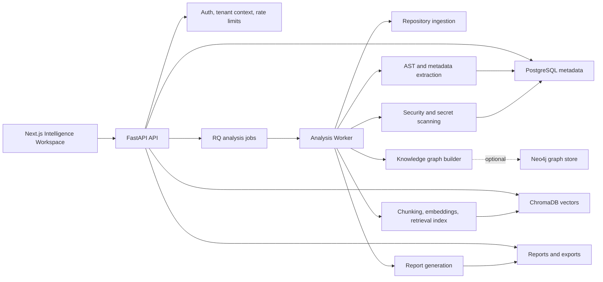

# RepoMindAI

**Repository intelligence for CTOs, staff engineers, engineering managers, founders, investors, and technical diligence teams.**

RepoMindAI analyzes a codebase and turns it into an evidence-backed view of architecture, risk, ownership signals, security posture, PR impact, repository evolution, and due-diligence readiness.

It is not an IDE assistant. It is a repository understanding system for people who need to make engineering decisions from code.


## Problem

Most engineering organizations can search code. Fewer can quickly answer:

- What does this repository actually do?
- Which files and services are critical?
- What changed architecturally over time?
- Which security findings matter to the business?
- What would be risky in a PR?
- Is this repository ready for a CTO review, acquisition review, or investor diligence process?

The knowledge usually lives across code, PR history, dependency files, security scanner output, internal docs, and senior engineers' memories. That makes onboarding slow, architecture drift hard to see, and technical diligence manual.

## Gap in Existing Tools

GitHub, SonarQube, Snyk, CodeScene, and Sourcegraph are strong tools. They do not solve the same problem.

| Tool | Strong at | Gap RepoMindAI targets |
| --- | --- | --- |
| GitHub | Source hosting, PRs, code search, code scanning | Does not synthesize architecture, diligence, graph, and executive risk into one evidence packet. |
| SonarQube | Code quality, maintainability, reliability, security rules | Primarily scanner/quality-gate oriented, not CTO due-diligence oriented. |
| Snyk | Developer security, dependency and supply-chain risk | Security-first, not repository architecture and acquisition-readiness first. |
| CodeScene | Code health, hotspots, technical debt trends | Strong behavioral analysis; less focused on RAG citations, AI architect review, and diligence packets. |
| Sourcegraph | Enterprise code search and code intelligence | Excellent search layer; RepoMindAI focuses on repository-level decision synthesis and evidence-backed reports. |

Sources: [GitHub Code Search](https://github.com/features/code-search), [GitHub code scanning](https://docs.github.com/en/code-security/code-scanning), [SonarQube Cloud](https://docs.sonarsource.com/sonarcloud/), [Snyk docs](https://docs.snyk.io/), [CodeScene Code Health](https://codescene.io/docs/guides/technical/code-health.html), [Sourcegraph Code Search](https://sourcegraph.com/docs/code_search).

## Why RepoMindAI Exists

RepoMindAI was built around one product belief:

> Repository intelligence should be explainable, evidence-backed, and useful to both executives and engineers.

The system parses repositories, builds summaries and graphs, indexes code for retrieval, scans for security and debt signals, and generates decision-oriented views. Every major score is designed to expose factors, weights, confidence, and citations.

## What Makes It Different

- **Evidence-first output**: scores, chat answers, reports, and findings point back to files, lines, symbols, routes, scanner findings, or graph relationships.
- **Architecture as a product surface**: request flows, dependency maps, blast-radius views, drift, and repository timelines are first-class.
- **Diligence-oriented reports**: CTO, investor, security, acquisition, roadmap, and executive packets are generated from repository evidence.
- **Multi-repository context**: portfolio views identify shared dependencies, repeated risks, framework concentration, and cross-repository remediation opportunities.
- **Local/private-code bias**: designed for private repository analysis without requiring a cloud LLM path.

## Core Features

| Capability | What it answers |
| --- | --- |
| Executive Cockpit | What is the repository's health, security posture, architecture health, and investment readiness? |
| Architecture Explorer | How do entry points, routes, services, models, dependencies, and integrations fit together? |
| Repository Knowledge Graph | What files, symbols, dependencies, risks, and relationships define the system? |
| AI Architect Review | What is risky, tightly coupled, hard to scale, or worth refactoring? |
| PR Risk Intelligence | What is the blast radius of changed files, and what should reviewers test? |
| Repository Time Machine | How did risk, dependencies, architecture, and complexity evolve? |
| Due Diligence Center | What would a CTO, investor, acquirer, or security reviewer need to know? |
| Evidence-backed Chat | Can a user ask repository questions and receive cited answers? |

## Screenshots

| Executive Cockpit | Architecture Explorer |
| --- | --- |
|  |  |

| Knowledge Graph | Due Diligence |
| --- | --- |
|  |  |

## Architecture



## Validation Results

RepoMindAI includes validation artifacts rather than only screenshots.

The strongest scale artifact is [`docs/evidence/SCALE_VALIDATION_1000.md`](docs/evidence/SCALE_VALIDATION_1000.md):

| Metric | Result |
| --- | ---: |
| Repositories tested | 1,000 |
| Languages | Python, TypeScript, Java, Go, Rust, C#, Kotlin, PHP |
| Pass rate | 1.000 |
| Failure rate | 0.000 |
| Citation accuracy | 0.824 |
| Retrieval accuracy | 0.824 |
| Architecture correctness | 0.961 |

Additional evidence:

- [`docs/evidence/BENCHMARK_RESULTS.md`](docs/evidence/BENCHMARK_RESULTS.md): FastAPI, Flask, Next.js, and RepoMindAI benchmark runs.
- [`docs/evidence/FINAL_INTELLIGENCE_VALIDATION.md`](docs/evidence/FINAL_INTELLIGENCE_VALIDATION.md): retained 100-repository validation batch.
- [`UX_AUDIT.md`](UX_AUDIT.md): frontend UX audit, screenshots, before/after issue counts, and fixes.

These results prove useful repository-intelligence behavior over a validation corpus. They do not claim production SaaS readiness or human-labeled semantic perfection.

## Tech Stack

| Layer | Stack |
| --- | --- |
| Frontend | Next.js 14, React 18, TypeScript, Tailwind CSS, React Flow, Mermaid, Vitest, Playwright |
| Backend | Python 3.12, FastAPI, Pydantic, SQLAlchemy, Alembic, RQ, Prometheus metrics |
| Analysis | Python AST, Tree-sitter language packs, Radon, custom parsing and classification |
| Security | Bandit, Semgrep integration, custom rules, secret redaction, upload and SSRF protections |
| Retrieval | ChromaDB, BGE embeddings, hybrid lexical/vector ranking, citation validation |
| Storage | PostgreSQL in production, SQLite local fallback, artifact/report storage |
| Graph | NetworkX local processing, optional Neo4j persistence |

## Local Setup

```bash
python -m venv .venv
.venv/bin/pip install -e ".[analysis,dev]"

REPOMIND_API_KEY=dev-key \
REPOMIND_AUTH_SECRET=development-secret-development-secret \
REPOMIND_SECRET_KEY=development-secret-key \
REPOMIND_ENABLE_MODEL_INFERENCE=false \
PYTHONPATH=backend \
.venv/bin/uvicorn repomind.main:app --reload --port 8000
```

```bash
cd frontend
npm install
NEXT_PUBLIC_API_BASE_URL=http://localhost:8000 \
NEXT_PUBLIC_REPOMIND_API_KEY=dev-key \
npm run dev
```

Open `http://localhost:3000`.

## Validation Commands

```bash
.venv/bin/pytest -q
.venv/bin/ruff check backend tests scripts
.venv/bin/ruff format --check backend tests scripts

cd frontend
npm run lint
npm run typecheck
npm run test
npm run build
```

## Roadmap

- Add more human-labeled answer and citation evaluation.
- Improve large-monorepo indexing latency and Chroma upsert performance.
- Expand parser precision for Java, C#, Kotlin, PHP, and Rust.
- Strengthen CODEOWNERS, GitHub review history, and team ownership inference.
- Improve production deployment proof for hosted multi-tenant use.
- Add richer PR test-impact and CI evidence ingestion.

## Creator

RepoMindAI is built by **Ratish Oberoi**, CTO and full-stack AI/ML builder.

Ratish has raised **₹1 Cr in pre-seed funding** and is focused on practical AI systems for engineering intelligence, technical diligence, and product decision-making.

## License

MIT. See [`LICENSE`](LICENSE).
