# RepoMindAI

**CTO-grade repository intelligence for architecture, security, diligence, and engineering leadership.**

RepoMindAI turns a source repository into an evidence-backed intelligence workspace: executive health scores, architecture maps, knowledge graphs, PR risk analysis, security posture, due-diligence packets, repository evolution timelines, and cited chat answers.

It is built for people who need to understand a codebase without relying on tribal knowledge or a week of manual spelunking.

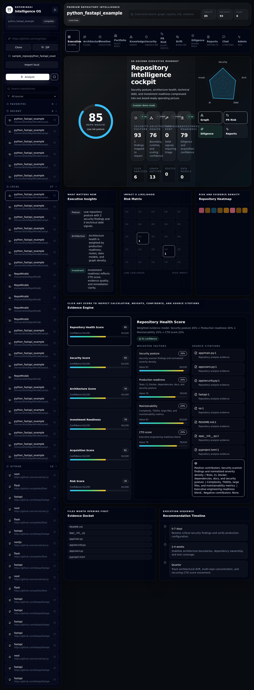


## Live Demo Walkthroughs

These lightweight GIFs were recorded from the running local application against completed repository analysis data.

| Executive Cockpit | Architecture Explorer | Diligence and PR Risk |
|---|---|---|
| 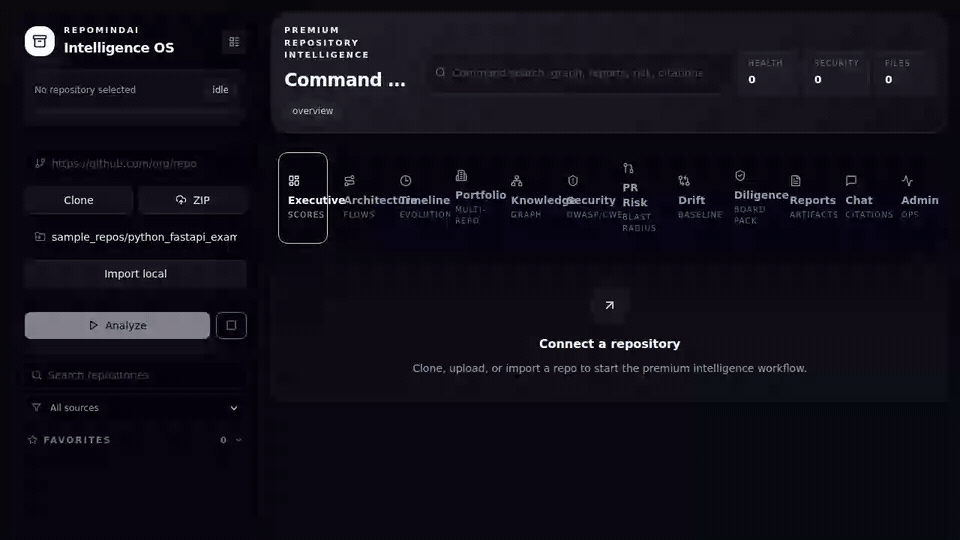 | 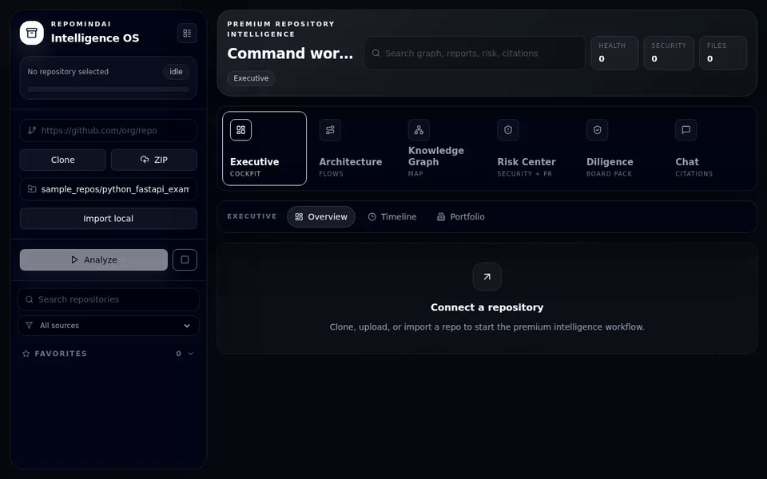 | 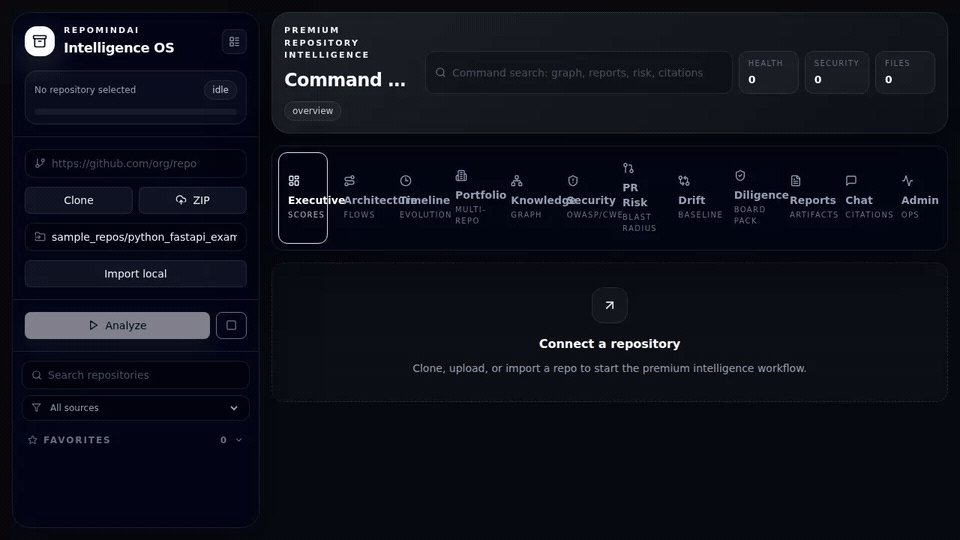 |
| Board-ready repository health, security posture, architecture health, risk, and recommendation context. | Request-flow and architecture intelligence with real parsed repository evidence. | PR blast-radius analysis and diligence workflow for leadership review. |

---

## 1. The Problem

Repository intelligence is still fragmented.

Most teams can answer small code questions. Few teams can answer strategic engineering questions quickly:

- "Which services would break if this authentication module changed?"
- "Does this repository look acquisition-ready?"
- "Where did architecture drift from the original design?"
- "Which files explain the security score?"
- "What risks should a CTO care about before funding, buying, or scaling this product?"

The underlying causes are familiar:

- **Codebases are too large.** A mature application can contain thousands of files, generated code, legacy modules, framework glue, infrastructure config, test suites, and abandoned experiments.
- **Tribal knowledge does not scale.** The people who know why a service exists, which files are risky, or how deployments work are often unavailable during onboarding, audits, or acquisitions.
- **Architecture drift is invisible.** Systems evolve through PRs, incidents, hotfixes, and deadlines. The diagrams in docs rarely match the running repository.
- **Security findings lack business context.** A scanner can flag a finding, but it usually does not explain blast radius, ownership, diligence impact, or whether it blocks a release.
- **Onboarding takes weeks.** New engineers need a mental model of routes, services, data models, dependencies, tests, and operational risks before they can contribute safely.
- **CTOs cannot assess quality fast enough.** Engineering leaders need to understand architecture, maintainability, security posture, test confidence, and delivery risk before making hiring, funding, migration, or acquisition decisions.
- **Technical diligence is still manual.** Acquisition reviews, investor memos, and engineering audits are usually assembled from interviews, spreadsheets, scanner exports, and ad hoc code review.

RepoMindAI exists because these problems are not just search problems. They are evidence, architecture, risk, and decision-making problems.

---

## 2. Why RepoMindAI Exists

GitHub, SonarQube, Snyk, CodeScene, Sourcegraph, and static scanners are valuable, but they optimize for different jobs.

- GitHub is the system of record for code, issues, PRs, and code search.
- SonarQube focuses on code quality, maintainability, reliability, and security rules.
- Snyk focuses on developer security across code, dependencies, containers, cloud, and supply chain.
- CodeScene connects code health, hotspots, and delivery signals.
- Sourcegraph provides enterprise code search and codebase context.
- Static scanners find rule violations and known patterns.

The gap: none of these tools, by themselves, are designed to produce a CTO-ready, evidence-backed understanding of a repository's architecture, risks, acquisition posture, and business implications.

RepoMindAI's vision is to become the repository intelligence layer between raw code and engineering decisions:

- parse the repository,
- build a knowledge graph,
- attach evidence to every score and finding,
- explain architecture and risk in executive and engineering language,
- generate diligence-grade reports,
- answer questions with citations instead of unsupported claims.

---

## 3. What RepoMindAI Does

RepoMindAI is organized around the questions leaders and senior engineers ask during onboarding, scaling, risk review, and diligence.

### Executive Cockpit

The first screen summarizes repository health, security posture, architecture health, technical debt, investment readiness, and top risks.


### Architecture Explorer

Traces system structure from entry points to routes, services, models, integrations, dependencies, and request-flow evidence.

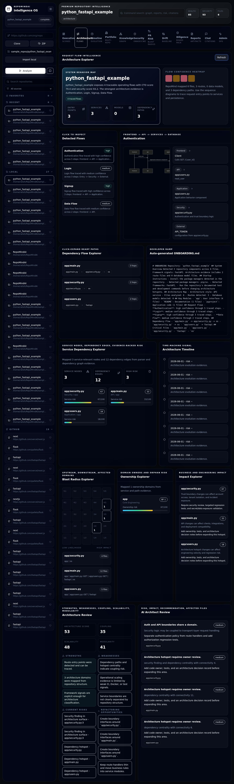

### Repository Knowledge Graph

Shows files, services, domains, dependencies, risks, security findings, owners, and relationships as an interactive graph.


### AI Architect Review

Generates architecture risks, coupling concerns, maintainability issues, modernization opportunities, and CTO recommendations with affected files and evidence.


### Repository Time Machine

Surfaces repository evolution, architecture drift, dependency changes, risk trends, and timeline evidence from repository metadata and git signals.


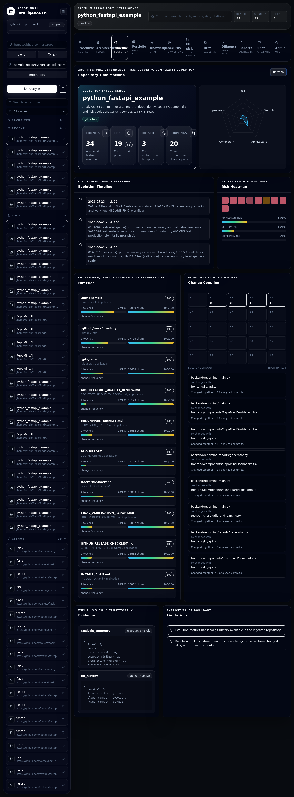

### PR Risk Intelligence

Analyzes changed files, affected domains, blast radius, review complexity, deployment risk, and recommended review focus.

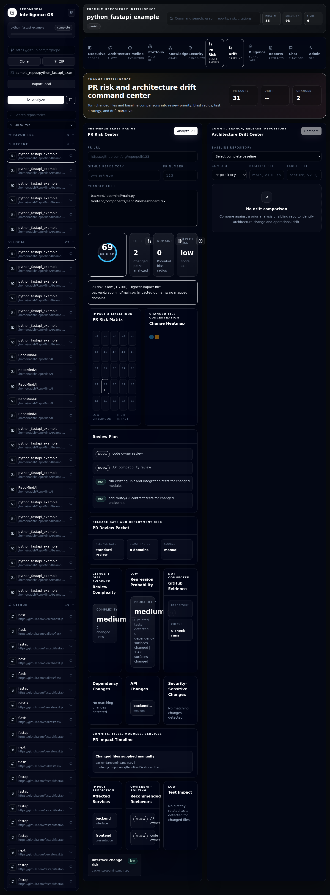

### Due Diligence Center

Produces investor, acquisition, CTO, and security-oriented views of repository maturity and risk.

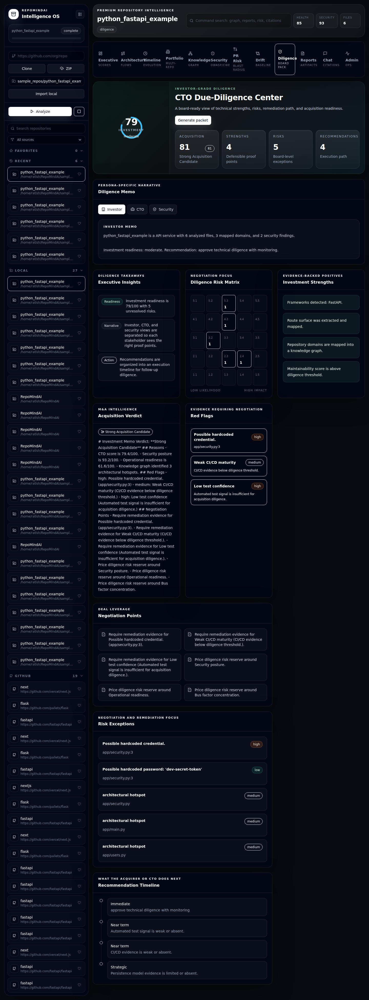

### Portfolio Intelligence

Compares multiple repositories for shared risks, dependency concentration, duplicated services, ownership concentration, and remediation leverage.

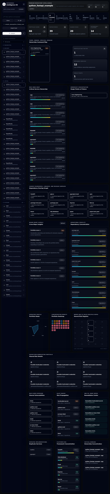

### Evidence-Backed Chat

Answers repository questions using retrieval over code, docs, reports, security findings, and graph evidence. Responses include citations and source context.

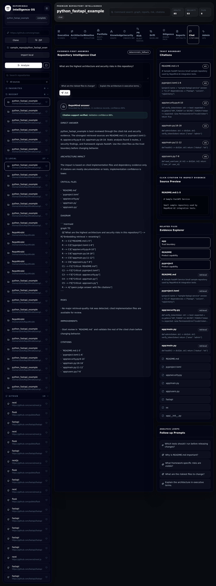

---

## 4. Architecture

### System Architecture

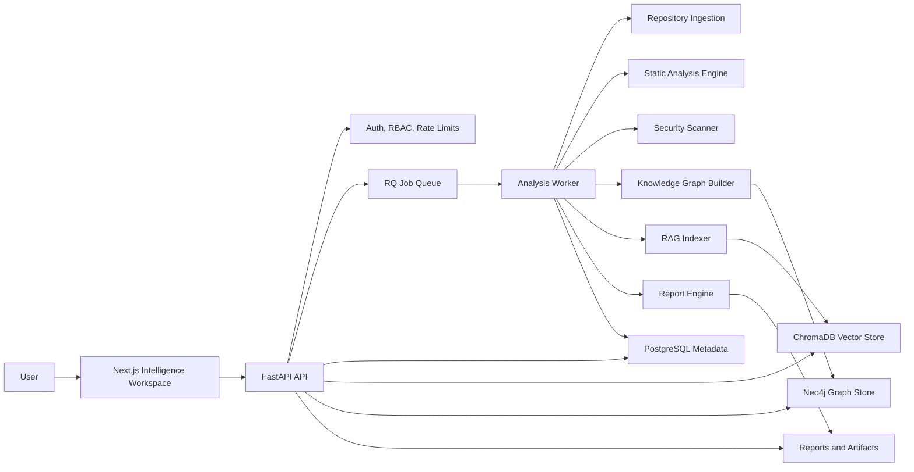

### Ingestion Flow

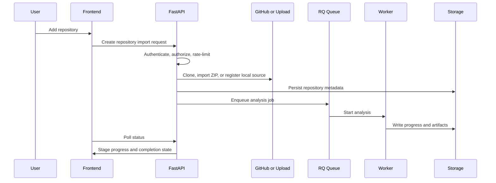

### Analysis Pipeline

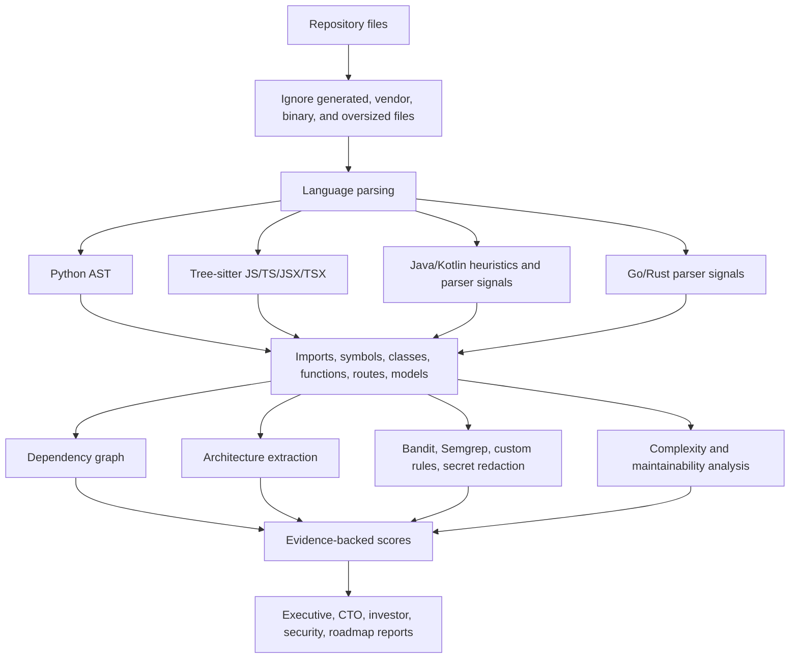

### Graph Generation

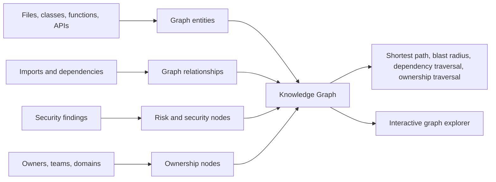

### Report Generation

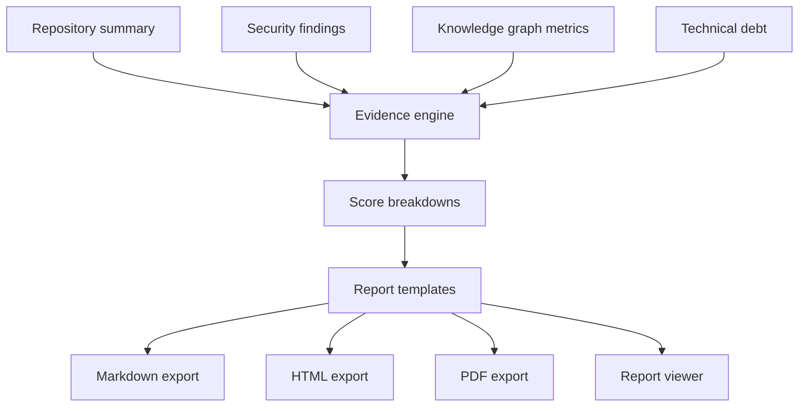

### Frontend and Backend Interaction

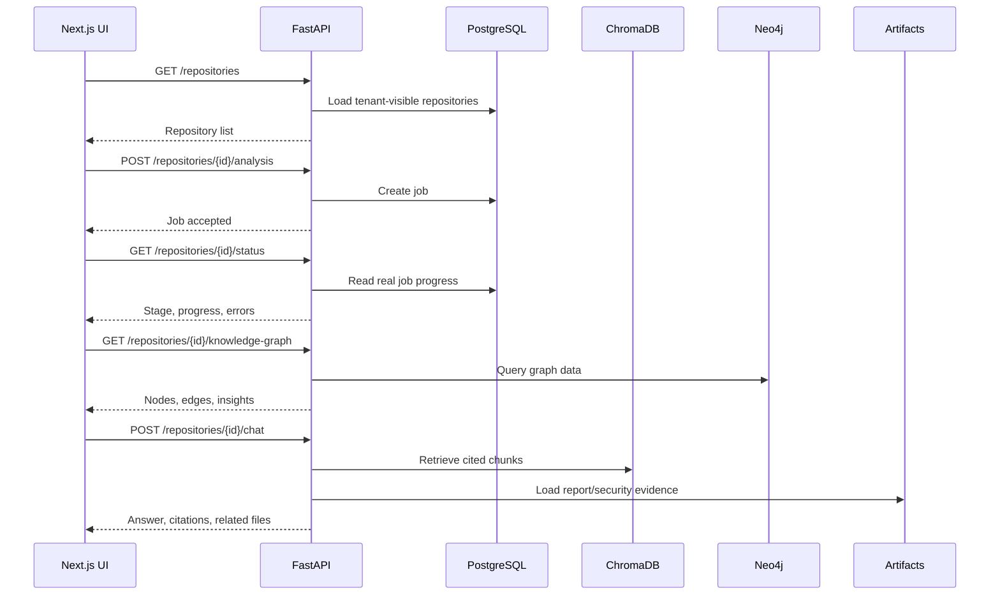

---

## 5. How It Works

1. **Repository ingestion**
   - Imports a GitHub repository, uploaded ZIP, or allowed local source.
   - Applies upload limits, ZIP extraction limits, SSRF protections, and source filtering.

2. **Parsing**
   - Parses supported languages with AST-aware and parser-assisted extraction where available.
   - Falls back to structured heuristics for unsupported language constructs instead of inventing facts.

3. **Metadata extraction**
   - Extracts imports, routes, symbols, classes, functions, methods, database signals, package metadata, environment variables, TODOs, and framework indicators.

4. **Graph generation**
   - Converts files, services, domains, APIs, dependencies, risks, owners, and findings into graph entities and relationships.
   - Supports blast-radius and dependency traversal through graph queries.

5. **Risk scoring**
   - Computes health, architecture, security, acquisition, investment, and risk scores from analyzable evidence.
   - Each score includes factors, weights, confidence, contributors, and citations.

6. **Evidence generation**
   - Links findings to files, lines, source snippets, scanner output, routes, graph nodes, and report sections.
   - Redacts sensitive content before indexing and answer generation.

7. **Report generation**
   - Produces executive, CTO, investor, due-diligence, security, architecture, roadmap, and summary reports in Markdown, HTML, and PDF-oriented formats.

---

## 6. Scoring Engine

RepoMindAI scores are designed to be explainable. They are not single opaque numbers.

Each score returns:

- numeric score,
- confidence,
- weighted factor breakdown,
- positive contributors,
- negative contributors,
- file citations and evidence.

Implemented score models include:

| Score | Formula |
|---|---|
| Repository Health | `0.30 * security + 0.30 * production_readiness + 0.20 * maintainability + 0.20 * cto` |
| Architecture Score | `0.40 * production_readiness + 0.20 * graph_density + 0.15 * route_evidence + 0.15 * service_modularity + 0.10 * hotspot_penalty_inverse` |
| Investment Readiness | `0.45 * cto + 0.25 * security + 0.20 * maintainability + 0.10 * confidence` |
| Acquisition Score | `0.24 * cto + 0.22 * security + 0.20 * production_readiness + 0.18 * maintainability + 0.08 * test_confidence + 0.08 * documentation_quality` |
| Risk Score | `0.34 * security_findings + 0.26 * architecture_hotspots + 0.20 * debt_findings + 0.20 * enterprise_gaps` |

Security scoring considers:

- critical findings,
- high findings,
- finding density per analyzed file,
- scanner coverage across custom rules, Bandit, and Semgrep.

Confidence is derived from the amount and quality of analyzable evidence: file count, parsed entities, indexed chunks, graph facts, scanner output, and citations.

---

## 7. Evidence-First Design

RepoMindAI is designed around a simple rule:

> If a conclusion cannot be connected to repository evidence, it should not be treated as a finding.

Evidence can come from:

- source files,
- line numbers,
- parsed symbols,
- routes,
- imports,
- dependency manifests,
- security scanner findings,
- graph relationships,
- generated reports,
- repository evolution data.

Example evidence object:

```json
{
  "score": "Security Score",
  "factor": "High findings",
  "weight": 0.25,
  "impact": 18.0,
  "citation": {
    "file": "backend/repomind/security/scanner.py",
    "line": 42,
    "evidence": "Security scanner finding normalized into repository risk"
  }
}
```

Evidence-first behavior matters for trust:

- Chat answers include citations.
- Scorecards expose weighted reasoning.
- Reports cite files and findings.
- Security findings map to affected files.
- Architecture insights are derived from parsed routes, symbols, imports, graph nodes, and repository metadata.

---

## 8. Feature Comparison

This comparison is based on public product positioning for [GitHub Code Search](https://github.com/features/code-search), [GitHub code scanning](https://docs.github.com/en/code-security/code-scanning), [SonarQube Cloud](https://docs.sonarsource.com/sonarcloud/), [Snyk](https://docs.snyk.io/), [CodeScene](https://codescene.com/manage-and-reduce-technical-debt), and [Sourcegraph Code Search](https://sourcegraph.com/docs/code_search).

| Capability | GitHub | SonarQube | Snyk | CodeScene | Sourcegraph | RepoMindAI |
|---|---|---|---|---|---|---|
| Source hosting and PR workflow | Strong | Limited | Limited | Limited | Integrates | Imports and analyzes repositories |
| Code search | Strong | Limited | Limited | Limited | Strong | Search plus retrieval, citations, and graph context |
| Static code quality | Limited | Strong | Partial | Strong | Limited | Integrated as one input to broader intelligence |
| Developer security | GitHub Advanced Security | Security rules | Strong | Limited | Limited | Security findings connected to architecture and diligence impact |
| Code health and hotspots | Limited | Quality gates | Limited | Strong | Limited | Hotspots connected to graph, risk, reports, and ownership context |
| Cross-repository code intelligence | GitHub search | Project analysis | AppSec portfolio | Portfolio signals | Strong | Portfolio risk, dependency concentration, shared findings, and diligence views |
| Architecture explanation | Limited | Limited | Limited | Partial | Search/context-driven | Architecture Explorer, request-flow evidence, graph traversal, drift views |
| Executive diligence reports | Limited | Quality/security reports | Security reports | Management reports | Limited | CTO, investor, acquisition, due-diligence, and roadmap reports |
| Evidence-backed AI chat | GitHub Copilot context varies by product | Not primary focus | Not primary focus | Not primary focus | Cody/code AI context | Repository RAG over code, reports, security findings, and graph evidence |
| Local-first repository analysis | No | Self-host option | SaaS-first | SaaS/on-prem depending edition | Enterprise/self-host options | Designed for local and private repository intelligence |

RepoMindAI is not trying to replace these systems. It sits above them as a repository intelligence layer for architecture, risk, diligence, and leadership decisions.

---

## 9. Showcase

The `showcase/` package contains screenshots captured from the running local application. The validation note is in [`showcase/SHOWCASE_VALIDATION.md`](showcase/SHOWCASE_VALIDATION.md).

| Screen | Screenshot |
|---|---|
| Executive Overview |  |
| Architecture Explorer |  |
| Knowledge Graph |  |
| Security Center | 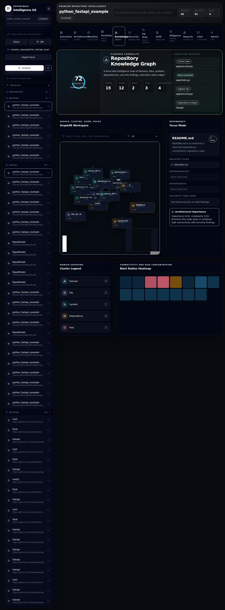 |
| PR Intelligence |  |
| Architecture Drift | 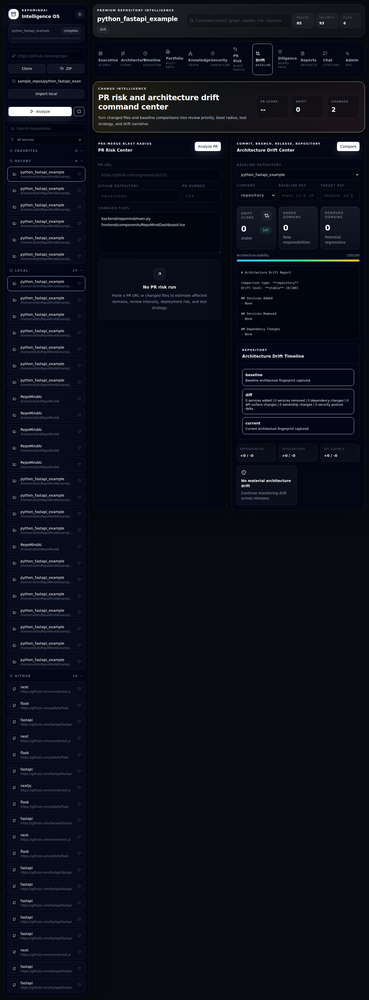 |
| Portfolio Intelligence |  |
| AI Architect Review |  |
| Due Diligence |  |
| Reports | 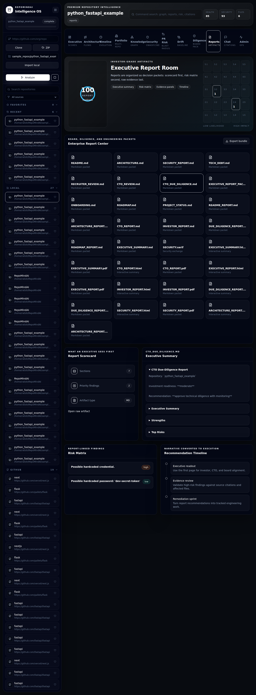 |
| Repository Timeline |  |
| Repository Evolution |  |
| Chat Intelligence |  |

---

## 10. Tech Stack

### Frontend

- Next.js 14
- React 18
- TypeScript
- Tailwind CSS
- React Flow
- Mermaid
- lucide-react
- Vitest
- Playwright

### Backend

- Python 3.12+
- FastAPI
- Pydantic
- SQLAlchemy
- Alembic
- RQ workers
- Prometheus metrics
- Structured security and audit controls

### Storage

- PostgreSQL for metadata in production
- SQLite fallback for local development
- ChromaDB for vector indexes
- Report and artifact storage on disk-compatible volumes

### Graph Engine

- NetworkX for local graph processing
- Neo4j integration for graph persistence and traversal when configured

### AI Components

- `BAAI/bge-small-en-v1.5` embeddings
- ChromaDB retrieval
- Hybrid retrieval with vector, lexical, metadata, path, and pinned-evidence ranking
- Local `qwen-judge` inference path when configured
- Graceful fallback behavior when local generation is unavailable

### Security and Analysis

- Python AST parsing
- Tree-sitter language packs
- Bandit
- Semgrep
- Custom security rules
- Secret redaction before indexing and prompting
- DNS-aware SSRF mitigation for Git ingestion
- ZIP bomb and upload limits

---

## 11. Performance

RepoMindAI includes both benchmark and validation evidence. The current public evidence should be read as local engineering validation, not a hosted production SLA.

### Real-Repository Benchmarks

Benchmarks in [`docs/evidence/BENCHMARK_RESULTS.md`](docs/evidence/BENCHMARK_RESULTS.md) used real ingestion, static analysis, BGE embeddings, ChromaDB indexing, local report generation, repository explainers, and cleanup verification.

| Repository | Files analyzed | Indexed chunks | Analysis wall time | Indexing time | Report generation |
|---|---:|---:|---:|---:|---:|
| FastAPI | 2,748 | 10,862 | 214.669s | 34.913s | 75.228s |
| Flask | 231 | 857 | 71.975s | 1.940s | 67.421s |
| Next.js | 25,024 | 50,996 | 200.799s | 92.848s | 65.757s |
| RepoMindAI | 66 | 220 | 84.715s | 9.770s | 73.348s |

### Intelligence Validation

[`docs/evidence/FINAL_INTELLIGENCE_VALIDATION.md`](docs/evidence/FINAL_INTELLIGENCE_VALIDATION.md) records a retained validation batch of 100 real repositories:

| Metric | Baseline | Retained result |
|---|---:|---:|
| Failure rate | 0.020 | 0.000 |
| Citation accuracy | 0.211 | 0.775 |
| Retrieval accuracy | 0.098 | 0.775 |
| Architecture correctness | 0.148 | 0.848 |

Known limits are documented in the same validation file: the final retained validation covers 100 repositories, not full production-scale public traffic; large Java repositories remain a timeout risk; Chroma upsert and embedding remain scale bottlenecks.

---

## 12. Why This Is Different

RepoMindAI is different because it treats a repository as an operating system of evidence, not just a folder of files.

Most tools answer one category of question:

- "Where is this code?"
- "Is this dependency vulnerable?"
- "Does this code violate a rule?"
- "Which file is a hotspot?"

RepoMindAI is built to answer multi-layer questions:

- "What does this repository do, and how confident are we?"
- "Which architecture decisions are risky?"
- "What would break if this service changed?"
- "Is this product ready for an acquisition review?"
- "Which findings matter to a CTO versus a developer?"
- "Which files support that conclusion?"

The core design choices are:

- evidence-first scoring,
- graph-based architecture understanding,
- cited repository chat,
- executive and engineering views over the same source data,
- local-first analysis for private repositories,
- diligence artifacts that can be reviewed, challenged, and improved.

---

## 13. Roadmap

Near-term milestones:

- Expand human-labeled validation beyond automatic evidence checks.
- Increase large-repository and monorepo coverage.
- Improve Java, C#, Kotlin, PHP, and Rust parser precision.
- Reduce embedding and Chroma upsert latency for large repositories.
- Add stronger CI evidence ingestion and test-impact analysis.
- Harden production multi-tenant deployment paths.
- Improve Neo4j-backed graph traversal performance for very large graphs.
- Add richer ownership signals from CODEOWNERS, GitHub teams, commits, and review history.

Longer-term direction:

- Continuous architecture drift monitoring.
- Organization-wide engineering intelligence.
- Due-diligence data rooms for private codebases.
- Verified AI architect recommendations with stronger human feedback loops.
- Enterprise policy packs for security, architecture, and acquisition readiness.

---

## 14. About the Creator

RepoMindAI is built by **Ratish Oberoi**, CTO and builder with an AI/ML and full-stack engineering background.

Ratish has raised **₹1 Cr in pre-seed funding** and is focused on building practical AI systems for engineering intelligence, technical diligence, and decision support.

This project is intended to demonstrate serious end-to-end engineering: backend analysis pipelines, retrieval systems, graph intelligence, security review, executive UX, validation evidence, and product thinking in one repository.

---

## Quickstart

### Requirements

- Python 3.12+
- Node.js 18+
- PostgreSQL for production metadata
- Redis for production background jobs
- Optional Neo4j for persistent graph traversal
- Optional local `qwen-judge` checkpoint for model-backed generation

### Backend

```bash
python -m venv .venv
.venv/bin/pip install -e ".[analysis,dev]"

REPOMIND_API_KEY=dev-key \
REPOMIND_AUTH_SECRET=development-secret-development-secret \
REPOMIND_SECRET_KEY=development-secret-key \
REPOMIND_ENABLE_MODEL_INFERENCE=false \
PYTHONPATH=backend \
.venv/bin/uvicorn repomind.main:app --reload --port 8000
```

### Frontend

```bash
cd frontend
npm install
NEXT_PUBLIC_API_BASE_URL=http://localhost:8000 \
NEXT_PUBLIC_REPOMIND_API_KEY=dev-key \
npm run dev
```

Open:

```text
http://localhost:3000
```

### Validation

```bash
.venv/bin/pytest -q
.venv/bin/ruff check backend tests scripts
.venv/bin/ruff format --check backend tests scripts

cd frontend
npm run lint
npm run typecheck
npm run test
npm run build
```

---

## Repository Map

```text
backend/repomind/
  analysis/        Parsing, graph extraction, debt analysis, architecture extraction
  core/            Configuration, auth, jobs, cleanup, observability, security controls
  db/              SQLAlchemy metadata models
  ingestion/       GitHub, ZIP, and local import handling
  intelligence/    Architecture, acquisition, drift, evidence, graph, portfolio, PR risk
  integrations/    GitHub API integration
  llm/             Local model adapter and prompt utilities
  rag/             Chunking, embeddings, retrieval, indexing, chat QA
  reports/         Report generation and exports
  security/        Scanner, Semgrep rules, redaction

frontend/
  app/             Next.js app shell
  components/      Design system and feature surfaces
  lib/             API client and shared frontend utilities
  e2e/             Playwright smoke and visual tests

showcase/          Runtime screenshots and showcase validation evidence
reports/           Generated validation and progress artifacts
data/              Local metadata, proof, index, and validation artifacts
```

---

## License

MIT License. See [`LICENSE`](LICENSE).
