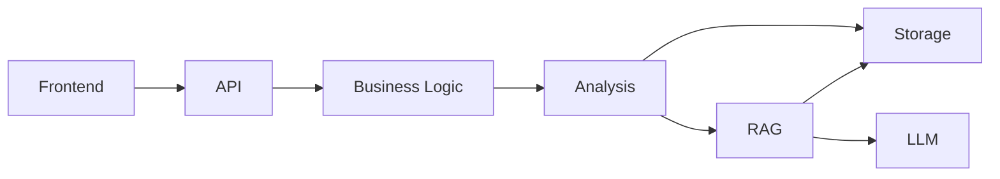

# Architecture Experience

RepoMind AI treats architecture as a product surface, not a file graph.

## Four-Level Model

### 1. Executive Architecture

Purpose: explain the project in under 10 seconds.

Shows:

- Frontend
- Backend
- Analysis Engine
- Vector Store
- Local LLM

Does not show:

- files
- imports
- classes
- individual routes

### 2. Service Architecture

Purpose: explain how repository intelligence moves through the system.

Shows:

- Repository Ingestion Service
- AST Analysis Service
- Dependency Engine
- Security Engine
- RAG Engine
- Report Engine

### 3. Module Architecture

Purpose: explain code ownership without making a hairball.

Shows collapsed modules:

- `frontend/*`
- `ingestion/*`
- `analysis/*`
- `rag/*`
- `reports/*`
- `llm/*`
- `storage/*`

Files are hidden by default and only appear when a module is expanded.

### 4. Implementation Architecture

Purpose: debug and validate.

Only this level shows:

- files
- classes
- functions
- methods
- imports
- routes
- database model nodes

## Interaction Design

The architecture canvas includes:

- React Flow rendering
- ELK auto-layout
- Dagre fallback
- fullscreen mode
- zoom and pan
- minimap
- search
- focus mode
- animated edges
- service icons
- hover impact cards
- node details drawer

## Quality Rules

- Executive view must fit on one screen.
- Service view must show services, not files.
- Module view must be collapsed by default.
- Implementation view may be technical, but it must be opt-in.
- Dependency view must be layered by architectural responsibility.
- If the graph looks like a hairball, the abstraction is wrong.

## Dependency Layers

## Screenshot Evidence

- `screenshots/architecture-view.png`
- `screenshots/dependency-view.png`

## Status

Current architecture UX status: **release-candidate quality**

Known limitation: dependency layers are intentionally aggregated. They are designed for comprehension first, not exhaustive import debugging.
